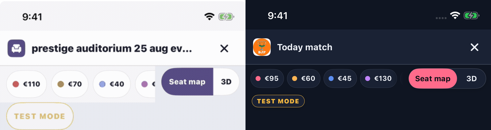
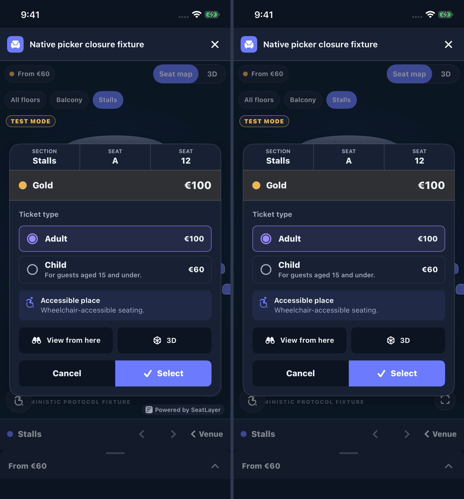
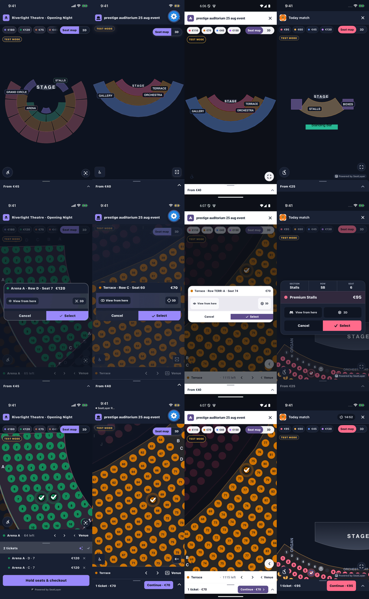
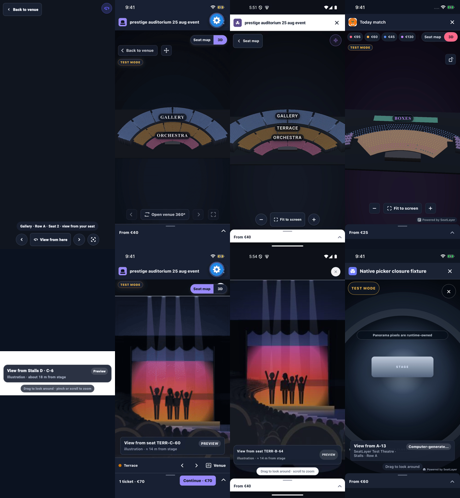

# Native picker visual correction — 2026-08-31

## Outcome

The previous iOS visual approval is rejected. The implementation compiled and
its protocol surface was broad, but the released composition was not acceptable:
the legend and map/3D selector occupied the same unbounded space, category chips
were clipped beneath the selector, the title compressed too early, Test Mode
floated as an oversized debug badge, several controls painted at their full
44-point hit size, and overlay truth reduced or obscured the map. Passing tests
did not make those pixels correct.

This correction rebuilds the visible hierarchy around the same public API and
one renderer session. It does not claim pixel identity with another platform.
It does require the same product hierarchy: event identity first; a bounded,
scrollable price legend beside a stable view selector; optional floor context;
compact required truth; the map as visual anchor; a focused decision surface;
and a reachable cart/checkout action.

The final attribution refinement also rejects the earlier iOS-only placement
in the top truth row. “Powered by SeatLayer” now uses the same compact three-bar
mark as the other SDKs, stays at the safe bottom-right edge, and is rendered
only when the runtime snapshot says `branding.attributionRequired == true`.
Host chrome options cannot force it on or suppress it.

The left capture uses the same production native controller with runtime
attribution required; the right capture differs only by the runtime branding
value. The right side removes the attribution and reclaims the control inset.

## Reference locks and trust boundary

The audit used source and pixels, not the previous prose.

| Platform | Locked reference | What was used |
| --- | --- | --- |
| Flutter | `848be0c3dfadaba5efcda04d951a436cbd983e6f` | `lib/src/picker/`, `test/goldens/`, and `doc/media/picker-flow.gif`; the flexible legend plus fixed selector and compact 30/32-point paint inside 44-point targets are the primary top-chrome reference. Attribution renders only for runtime `branding.attributionRequired == true` and uses the three-bar mark. |
| React Native | source commit `9046330090d86b8c7e88f8967a763c9af05a8261` | Picker source at the required commit supplied measured legend/selector geometry, overflow, RTL, target behavior, and runtime-owned attribution visibility with the three-bar mark. The public GIF at current checkout `73cea45c52452ecf3918c37145d90ca79c69ab54` was used only as visible corroboration, not presented as evidence from the older source commit. |
| Android | `cd7451c68bc7cadcc7945e159dc0f74523b270b0` | Current native-picker source and the picker-only Android recording; its resolved compact hierarchy and map-to-cart balance were treated as a primary quality reference. Its attribution also follows the snapshot branding requirement. |
| Web/runtime | `seatlayer-js@0.71.5`, source commit `4628345457409976a7fd477a3bdb41e2077c4b49` | Pinned source hierarchy and renderer ownership. The runtime derives `branding.attributionRequired` from API theme policy; iOS consumes that snapshot truth rather than inventing a local override. A local browser harness still targeted the retired `seatmap-api.paiteq.in` endpoint and could not load inventory, so it was not used as visual proof and no synthetic web screenshot was substituted. |
| iOS baseline | `5eb4965` before this correction | Rejected screenshot, rejected animation, final source diff, fresh hosted runtime, and deterministic closure fixture. |

The comparison sheets normalize only framing; they do not recolor or redraw the
SDK captures.

Columns are Flutter, React Native, Android, and corrected iOS. Rows are venue
overview, pending seat confirmation, and selected/cart state. The shared
hierarchy is visible even where each platform uses native typography and
surface mechanics.

Columns are Flutter, React Native, Android, and corrected iOS. The upper row is
venue 3D. The lower row is panorama/seat-view chrome. Hosted and deterministic
sources are deliberately labelled in the manifest because the controlled iOS
hosted event does not publish authored panorama content.

## What changed

- Header geometry now gives the event title explicit compression priority,
  keeps logo, active-hold pill, and close stable, and adds the venue subtitle
  only when wide space exists. Close retains a 44-point target.
- The legend and map/3D selector now form one deliberate rail. The legend owns
  the remaining measured width, scrolls within that width, exposes a logical
  trailing overflow fade in LTR and RTL, and can never render underneath the
  fixed selector.
- Compact chip paint is 30 points and the selector paint is 32 points inside
  independent 44-point interaction frames. Regular paint is 40 points. The
  floor strip follows the same paint-versus-hit-target discipline.
- Test Mode is a compact 20-point truth badge in the upper truth row.
  Attribution is independent, API-owned, and anchored at bottom-right. Wide
  overview layouts place it at the bottom-right of the side rail; wide decision
  layouts and compact layouts use a safe bottom-right overlay.
- The legacy host `chrome.attribution` option remains source-compatible but is
  deliberately non-authoritative. Only the decoded runtime branding snapshot
  decides whether attribution exists.
- Map controls paint at the shared compact control size inside 44-point targets.
  The duplicate in-map view selector is suppressed when the fixed rail owns it,
  and bottom controls receive an attribution inset only while the badge exists.
- Renderer top and bottom insets are calculated from the rails, truth band,
  immersive controls, dock, and cart rather than stale visual guesses.
- Phone decision cards scroll internally while their Cancel/Select actions
  remain sticky and reachable. The same rule holds for Arabic RTL and large
  Dynamic Type. Wide decision cards reserve required truth correctly.
- Venue 3D no longer displays a redundant large “Seat map” control when the
  fixed top selector already owns that transition. Target-specific “Back to
  venue” remains available where it expresses a different navigation level.

Changed implementation files:

- `Sources/SeatLayer/Picker/SeatLayerPicker.swift`
- `Sources/SeatLayer/Picker/SeatLayerPickerChrome.swift`
- `Sources/SeatLayer/Picker/SeatLayerPickerModels.swift`
- `Sources/SeatLayer/Picker/SeatLayerPickerOptions.swift`
- `Tests/SeatLayerTests/PickerSnapshotTests.swift`
- `Example/SeatLayerDemo/Resources/picker-closure-fixture.html`

## Twenty-five-part visible ownership audit

“Fresh” means inspected again after this source correction. “Retained” means
the part was audited against source and existing direct evidence but its visual
implementation did not change in this correction. Hosted and deterministic
lanes are never conflated.

| # | Public part | Cross-SDK conclusion | iOS evidence and status |
| ---: | --- | --- | --- |
| 1 | Header | Compact identity bar, stable close, title yields after fixed actions. | Fresh redesign; hosted light/dark, 320/390/430/wide captures. |
| 2 | Legend | Horizontally bounded price/category chips; selector is a sibling, never an overlay. | Fresh redesign; before/after and overview comparison sheet. |
| 3 | Floor selector | Floor choice is secondary to price/view mode and appears only with authored floors. | Retained behavior; fixture floor state and 171-test suite. |
| 4 | Floor strip | Compact scroll rail with selected state and full touch targets. | Fresh geometry; 320/430 fixture and RTL/large-type capture. |
| 5 | Section navigator | Section context and venue return stay in the lower map ladder. | Freshly inspected in section, seat, and comparison captures. |
| 6 | Dock bar | Collapsed quantity/price remains the stable transition to cart. | Fresh hosted selected/cart capture and recording. |
| 7 | Accessibility filters | Access preferences are a native decision sheet, not renderer chrome. | Retained; existing sheet/applied evidence plus fresh RTL/large-type acceptance. |
| 8 | Map | Renderer remains the largest visual region and retains camera state. | Fresh hosted overview, section, seat selection, 3D, phone and iPad captures. |
| 9 | Map controls | Compact circular paint inside separate 44-point targets; no duplicate mode owner. | Fresh redesign and accessibility-tree inspection. |
| 10 | Best Available | Secondary buyer action that produces authoritative selection/hold truth. | Retained; existing hosted hold evidence and direct suite coverage. |
| 11 | Seat confirmation | One focused native decision surface with seat, price, access, view, and actions. | Fresh comparison sheet, hosted flow, 430 and wide captures. |
| 12 | Compact confirmation card | Scrollable details with sticky actions at narrow width. | Fresh 320-point and Arabic large-type captures. |
| 13 | General-admission prompt | Uses the same decision hierarchy and action ownership as reserved seating. | Retained source/fixture audit and direct suite coverage; hosted event has no GA choice. |
| 14 | Variable-table prompt | Quantity/table truth precedes confirmation and remains picker-owned. | Retained source/fixture audit and direct suite coverage; absent from hosted event. |
| 15 | Cart list | Seat lines, quantity, price, and removal remain explicit. | Fresh hosted expanded-cart capture and recording. |
| 16 | Cart sheet | Native bottom surface expands from the dock without hiding Continue. | Fresh hosted capture; compact and active-hold states inspected. |
| 17 | Venue 3D | Preserves top product truth and uses one clear return hierarchy. | Fresh hosted 3D capture and immersive comparison sheet. |
| 18 | Panorama/seat-view chrome | Immersive content owns its close/back layer without confirming a seat. | Fresh deterministic iOS capture in immersive comparison; hosted authored pixels unavailable. |
| 19 | Hold countdown | Compact active truth belongs in the header/cart, never on top of the map. | Fresh hosted selected/cart capture and picker-only recording. |
| 20 | Hold-lapse notice | Recovery is explicit and removes stale checkout ownership. | Retained existing lapse screenshot and transition tests. |
| 21 | Action error | Recoverable actions retain context; fatal errors replace invalid interaction. | Retained retryable/fatal screenshots and tests. |
| 22 | Checkout bar | Quantity/total and Continue stay visible, enabled only with valid picker truth. | Fresh hosted collapsed/expanded cart evidence; disabled behavior retained in tests. |
| 23 | Loading | Native progress state precedes renderer readiness without false inventory. | Retained loading screenshot and lifecycle tests. |
| 24 | Error | Retryable and fatal variants communicate ownership and recovery. | Retained direct light/dark screenshots and tests. |
| 25 | Empty | Empty, sold-out, and sales-closed remain distinct commercial truths. | Retained direct screenshots and state tests. |

Required non-builder truth was audited separately. Test Mode remains compact
and top-aligned. Attribution is bottom-right in hosted overview, section,
confirmation, hold, cart, and 3D evidence, plus deterministic compact and wide
evidence. The paired deterministic capture proves both the API-required and
API-disabled branches without substituting fixture pixels for hosted inventory.

## State and layout acceptance

### Fresh hosted lane

The rebuilt `SeatLayerPickerViewController` used the pinned production runtime
and controlled test inventory on a 390×844 iPhone Simulator. One picker-only
recording covers overview, section focus, seat focus, pending confirmation,
selection, a real active test hold, collapsed and expanded cart, and visible
Continue. The same picker-only recording includes the real venue 3D mode and
return transition. Continue is deliberately not activated in the public
animation, so no host checkout or receipt is shown.

Light and dark hosted overview pixels were inspected. The active hold/header,
cart, and 3D captures are dark. The 1024×1366 hosted wide overview is light.

### Fresh deterministic lane

The production native controller and bridge load a validation-only protocol-2
page for states the hosted event cannot author. Fresh captures cover multi-tier
confirmation, 320-point compression, 430-point large-phone composition,
700-point constrained-wide composition, 1024-point wide confirmation,
panorama, Arabic RTL, accessibility-extra-large type, and the final
attribution-required/disabled API branch at compact width and required branch
at wide width. Existing direct evidence remains authoritative for accessibility
filters, loading, retryable and fatal error, empty, sold-out, sales-closed, hold
lapse, and in-place theme continuity.

| Layout | Fresh method | Result |
| --- | --- | --- |
| 320pt compact | Exact 320-point picker host constrained inside the booted 390pt simulator; iOS 26.5 cannot create the obsolete first-generation-SE simulator profile. | Long title, legend, fixed selector, floors, truth, pending card, sticky actions, dock, and checkout fit without collision. |
| 390pt modern phone | Real 390×844 simulator, hosted and deterministic lanes. | No obscured category; map stays dominant; active hold, cart, and Continue remain reachable. |
| 430pt large phone | Real iPhone 15 Pro Max simulator profile. | Multi-tier card, top rails, truth, dock, and actions fit with balanced margins. |
| 700pt constrained wide | Exact 700-point wide picker host constrained inside the booted iPad simulator. | Renderer and 320-point native rail divide predictably; decision and required truth stay visible. |
| 1024pt wide iPad | Real 1024×1366 iPad simulator profile. | Hosted overview and deterministic tier decision preserve the renderer/rail composition without overlap. |

Evidence:

- [API-required versus API-disabled attribution](evidence/native-picker-correction-2026-08-31/ios-attribution-api-true-false-fixture-dark.png)
- [API-required attribution at wide width](evidence/native-picker-correction-2026-08-31/ios-wide-attribution-required-fixture-light.png)
- [320pt compact decision](evidence/native-picker-correction-2026-08-31/ios-compact-320-constrained-fixture-dark.png)
- [390pt hosted overview, dark](evidence/native-picker-correction-2026-08-31/ios-compact-hosted-overview-dark.png)
- [430pt large-phone decision](evidence/native-picker-correction-2026-08-31/ios-large-430-fixture-overview-dark.png)
- [700pt constrained wide](evidence/native-picker-correction-2026-08-31/ios-constrained-wide-700-fixture-light.png)
- [1024pt hosted wide overview](evidence/native-picker-correction-2026-08-31/ios-wide-hosted-overview-light.png)
- [Arabic RTL and accessibility-extra-large](evidence/native-picker-correction-2026-08-31/ios-compact-confirmation-rtl-large-light.png)

Accessibility trees were inspected on the final phone and iPad binaries. Close,
legend chips, selector segments, floor choices, map controls, and confirmation
actions retain at least 44-point interaction frames even where their paint is
smaller. Pending decisions expose one focused action hierarchy; obscured map,
cart, and checkout controls are removed from assistive ownership until the
decision is answered. RTL reverses logical overflow and reading direction, and
sticky actions remain the final reachable controls.

Reduce Motion, Reduce Transparency, automatic theme continuity, focus
restoration, and one-owner semantics are behavior gates in the 171-test suite;
they are not inferred from still images.

## Recording and evidence classification

- Public GIF: `Docs/media/desipass-picker-flow.gif` — hosted picker only,
  480×1039, 272 frames, 34.01 seconds, 8 fps, SHA-256
  `4d4d4d3d60d077f44853f1f47f41546b61ebd106a109d5cf6b42e527f484403c`.
- Full hosted picker-only recording:
  `Docs/evidence/native-picker-correction-2026-08-31/ios-compact-hosted-picker-flow-dark.mp4`.
- Deterministic proof is stored as explicitly named fixture captures. It is not
  described as hosted inventory.
- The refreshed hosted dark set, API true/false sheet, wide required capture,
  and updated comparison sheets are the final attribution-placement evidence.
  Older unchanged state captures remain scoped to the other behavior named by
  their files and are not used to infer final attribution placement.
- `manifest.json` records source pins, devices, dimensions, and evidence lanes.
  `SHA256SUMS` is generated only after the final media and documentation settle.

## Direct verification

- Attribution predicate:
  `swift test --filter PickerSnapshotTests/testAttributionVisibilityFollowsRuntimeBranding`
  — **1 test passed, 0 failures**. It directly covers runtime true, explicit
  false, omitted-field compatibility, and no-snapshot behavior. The first
  sandboxed invocation could not write Swift/Clang caches; the identical
  unrestricted invocation completed successfully.
- The preceding visual-correction baseline remains **171 tests passed,
  0 failures**; no unrelated broad suite was repeated for this narrow branding
  placement change.
- Final demo build after the attribution change:
  `xcodebuild -project Example/SeatLayerDemo.xcodeproj -scheme SeatLayerDemo -sdk iphonesimulator -destination 'generic/platform=iOS Simulator' CODE_SIGNING_ALLOWED=NO build`
  — **BUILD SUCCEEDED** for arm64 and x86_64.
- Clean external consumer:
  `xcodebuild -scheme ExternalSeatLayerApp -sdk iphonesimulator -destination 'generic/platform=iOS Simulator' -derivedDataPath /private/tmp/seatlayer-ios-external-dd-final CODE_SIGNING_ALLOWED=NO build`
  — **BUILD SUCCEEDED**. It imports ready/custom SwiftUI and ready/custom UIKit
  using only the public local package.
- Pixels: inspected on 390×844 phone and 1024×1366 iPad, including side-by-side
  API-required/disabled compact states, bottom-control reclamation, wide rail
  placement, hosted confirmation, real hold, cart, and 3D. Existing
  accessibility-tree inspection remains valid because target ownership did not
  change.
- Static integrity: `git diff --check`, explicit staging, staged secret scan,
  and evidence hashes are final pre-commit gates.

No broad unrelated application suite was rerun. The new predicate test covers
the changed decision boundary; the demo build covers final SwiftUI composition
and both simulator architectures; the existing full-suite and consumer-build
results remain baseline integration evidence.

## Honest remaining gates

- The controlled hosted event has no buyer-selectable multi-tier seat and no
  authored panorama target. Those exact combinations remain deterministic
  protocol evidence until suitable hosted inventory exists.
- The installed iOS 26.5 simulator runtime cannot instantiate the obsolete
  320pt first-generation-SE profile. Exact 320-point layout was freshly rendered
  in a constrained host, but a physical 320pt device run is not claimed.
- The local Web demo's retired API endpoint prevented a fresh running Web
  screenshot. The required pinned Web source was inspected; a new supported
  demo event would be needed for browser pixel evidence.
- Physical-device installation remains blocked by the absence of an authorized
  signing account/profile for the demo bundle. Simulator and generic device
  compilation do not substitute for a signed hardware smoke test.
- Product-owner visual approval and any public release action remain external.

No credential, bearer, event key, opaque hold identifier, populated environment
file, or private endpoint response belongs in this evidence. Nothing in this
correction authorizes a push, tag, pull request, or publication.
