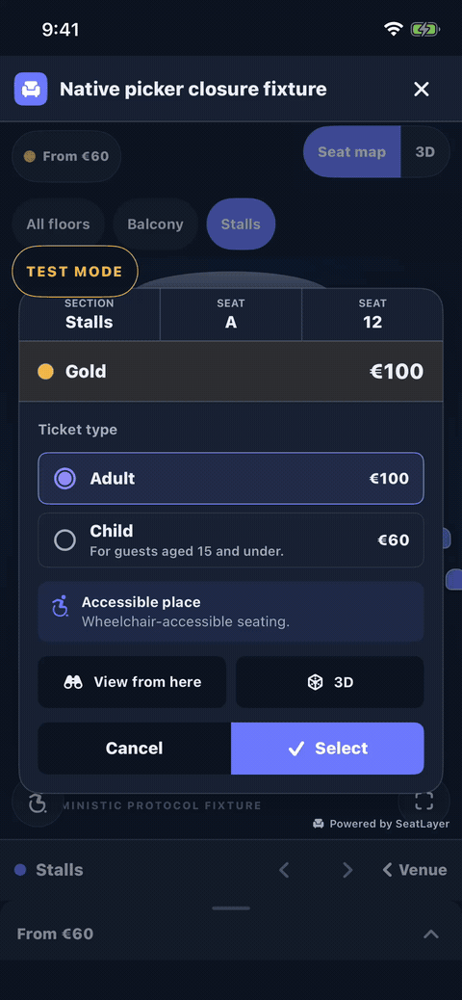
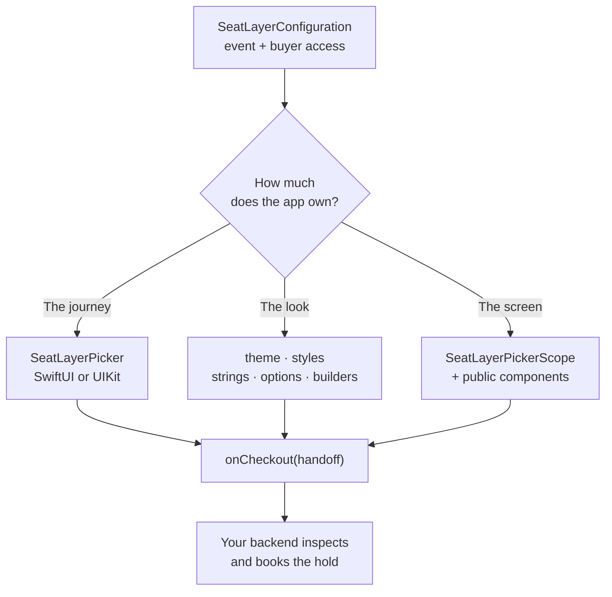

# SeatLayer iOS Seat Map SDK for Reserved Seating

[](https://github.com/seatlayer/seatlayer-ios/actions/workflows/ci.yml)
[](https://github.com/seatlayer/seatlayer-ios/releases/latest)
[](https://swift.org/)
[](https://developer.apple.com/ios/)
[](LICENSE)

The official SeatLayer iOS SDK for adding a native buyer picker or a raw
interactive seating chart to ticketing apps. The venue renderer stays in one
version-pinned `WKWebView`; headers, filters, confirmation, cart, hold state,
checkout, errors, and navigation are native SwiftUI/UIKit components backed by
a typed headless controller.

[iOS seat-map documentation](https://docs.seatlayer.io/buyer-sdk/mobile/) ·
[Buyer seat-map demo (web)](https://app.seatlayer.io/demo/play) ·
[SeatLayer reserved-seating platform](https://seatlayer.io/) ·
[SeatLayer Flutter seat map SDK](https://github.com/seatlayer/seatlayer-flutter) ·
[SeatLayer Android seat map SDK](https://github.com/seatlayer/seatlayer-android) ·
[SeatLayer React Native SDK](https://github.com/seatlayer/seatlayer-react-native) ·
[SeatLayer AI Toolkit](https://github.com/seatlayer/seatlayer-ai-toolkit)



The walkthrough starts directly inside the hosted SeatLayer picker with
controlled test inventory. It shows the picker-owned header, bounded price
legend, map/3D control, section and seat interaction, confirmation, active
hold countdown, expanded cart, and reachable Continue action. Continue is not
activated, so the recording contains no payment, booking, or host-only data.

The compact three-bar “Powered by SeatLayer” mark stays at the safe
bottom-right edge throughout that flow. Its visibility is runtime/API truth:
the SDK renders it only when the snapshot says
`branding.attributionRequired == true`. A server-side white-label entitlement
can turn it off; app chrome options and builders cannot force or suppress it.

Production views load the immutable, version-pinned mobile document and its lazy
assets from `https://cdn.seatlayer.io`. This canonical HTTPS origin is required
for origin-bound private buyer sessions; no event key or bearer is put in the
page URL.

- Swift package (SPM), iOS 15+
- Hosted runtime: `seatlayer-js@0.71.5/mobile.html`
- Explicit offline demo/test fixture: `seatlayer-js@0.59.0`
- Raw chart protocol: 1 (unchanged)
- Native picker protocol: 2 with snapshot contract 1

## Works as a native picker

**Every buyer control is native SwiftUI/UIKit.** SeatLayer's pinned renderer
draws venue geometry, seats, labels, the 3D scene, and panorama pixels. The SDK
draws the header, price and floor rails, map controls, decision surfaces, cart,
hold state, checkout action, loading/error states, and accessibility chrome.
There is one renderer session, so changing native presentation never creates a
second map or loses the buyer's camera, selection, or hold.

The three supported integration levels are a ladder. Customization keeps the
ready flow; composition keeps the controller, runtime truth, and checkout
contract:

| Level | You want | You write | You keep |
| --- | --- | --- | --- |
| **1** | The complete buyer flow | `SeatLayerPicker` or `SeatLayerPickerViewController` | Native layout, states, holds, and checkout |
| **2** | The flow in your brand and words | Theme, styles, strings, options, or builders | Canonical layout and behavior |
| **3** | Your own screen | `SeatLayerPickerScope` plus public components | Runtime snapshots, typed actions, holds, and handoff |



## Install

In Xcode, choose **File → Add Package Dependencies** and enter:

```text
https://github.com/seatlayer/seatlayer-ios.git
```

Or declare it explicitly in a manifest:

```swift
dependencies: [
    .package(url: "https://github.com/seatlayer/seatlayer-ios.git", from: "0.3.4")
]
```

Add the `SeatLayer` product to your iOS target, then import it:

```swift
import SeatLayer
```

## Ready-made native picker

SwiftUI receives the complete buyer journey in one view. `onCheckout` is
called once with the typed handoff after the runtime creates or reuses the
authoritative hold:

```swift
import SeatLayer
import SwiftUI

struct TicketPicker: View {
    var body: some View {
        SeatLayerPicker(
            configuration: SeatLayerConfiguration(
                event: "ev_xxx",
                locale: "en",
                currency: "USD"
            ),
            onCheckout: { handoff in
                try await checkoutBackend.begin(with: handoff)
            }
        )
    }
}
```

UIKit hosts the exact same component tree:

```swift
let picker = SeatLayerPickerViewController(
    configuration: SeatLayerConfiguration(event: "ev_xxx"),
    onCheckout: { handoff in
        try await checkoutBackend.begin(with: handoff)
    },
    onClose: { navigationController?.popViewController(animated: true) }
)
```

Use `picker.handleBack()` from UIKit navigation to consume the deterministic
prompt → cart → confirmation → section → venue → host ladder. Call
`updateAppearance(theme:themeMode:strings:styles:)` to change appearance
without remounting the renderer or losing selection/camera state.

`SeatLayerPickerCallbacks` exposes typed ready/load, selection/validity,
hold/expiry, access, unavailable-object, close/error, theme, section, seat,
seat-view, and Continue observations. The original one-argument
`onHoldChanged` callback remains source compatible; `onHoldTransition` adds
the optional hold/handoff lifecycle without changing that closure type.

Applicable Adult/Child/Companion tiers render natively and are applied before
confirmation, with the authoritative tier and price retained through cart and
checkout. Capability-gated native 3D chrome supports authored targets,
same-row previous/next boundaries, panorama inspection, and
target → overview → map navigation without confirming a pending seat.

For routes where latency matters, prewarm the page-only renderer host before
navigation. It contains no event or credentials and is consumed once:

```swift
Task { try await SeatLayerPicker.prewarm() }
```

**Stay current when the buyer returns.** The ready SwiftUI picker observes
`scenePhase`; the ready UIKit host observes application notifications. On
foreground they report lifecycle state to the runtime, consume any hold-lapse
or lost-inventory outcome, optionally request fresh availability, and then
synchronize the authoritative snapshot before new buyer actions.

`SeatLayerPickerOptions(refreshOnResume: false)` skips the optional explicit
availability request; runtime lifecycle truth is still consumed.
`announceHoldLapse: false` keeps reconciliation but leaves the visible lapse
message to the host. A custom host can call `controller.lifecycle`,
`controller.refreshAvailability()`, and `controller.synchronize()` directly.

See [Native picker integration](Docs/native-picker.md) and
[security and hold ownership](Docs/native-picker-security.md).

## Customize the picker

Four public layers change presentation without rebuilding inventory or hold
behavior.

**Colors — a semantic theme.** Native chrome and the renderer receive the same
approved roles, and `.auto` tracks the current iOS color scheme without
remounting:

```swift
let theme = SeatLayerPickerTheme(
    background: "#0F1522",
    surface: "#1A2234",
    text: "#EEF1F8",
    accent: "#FF6584",
    onAccent: "#111827",
    map: SeatLayerPickerMapTheme(
        background: "#0F1522",
        rowLabelColor: "#D7DEEA",
        textColor: "#EEF1F8",
        selectionColor: "#FF6584"
    )
)
```

**One surface — a typed style slot.** A style changes appearance, not ownership
or inventory truth:

```swift
var styles = SeatLayerPickerStyles()
styles[.checkoutBar] = SeatLayerPickerPartStyle(
    background: "#FF6584",
    cornerRadius: 18,
    horizontalPadding: 12,
    verticalPadding: 8
)
```

**Visibility and words — options and strings.** Chrome gates remove optional
default parts, while the 37 bundled locale dictionaries resolve exact BCP-47,
then language, then English:

```swift
let options = SeatLayerPickerOptions(
    chrome: SeatLayerPickerChromeOptions(floorStrip: false)
)
let strings = SeatLayerPickerStrings(
    overrides: [
        SeatLayerPickerStringKey.continueWord.rawValue: "Review order"
    ],
    localeIdentifier: "fr-FR"
)
```

**One whole part — a builder.** Each builder receives the live snapshot,
controller, presentation state, style, and the canonical `defaultContent`:

```swift
var builders = SeatLayerPickerBuilders()
builders.header = { context in
    AnyView(
        context.defaultContent
            .background(.ultraThinMaterial)
    )
}
```

Missing or throwing builders fall back to the canonical component. Test Mode
and `SeatLayerPickerAttribution` intentionally have no builder slot. Test Mode
follows runtime event truth. Attribution appears at bottom-right only when
`snapshot.branding.attributionRequired` is true. The legacy
`SeatLayerPickerChromeOptions.attribution` property remains for source
compatibility but is not an authority in either direction.

Pass `theme`, `themeMode`, `styles`, `strings`, `options`, and `builders` to
`SeatLayerPicker`; UIKit can apply theme/string/style changes in place with
`updateAppearance(theme:themeMode:strings:styles:)`.

## Build your own native picker

`SeatLayerPickerScope` gives a custom SwiftUI tree one controller, one
presentation model, and one renderer session. Use `SeatLayerPickerMap` for the
map and any of the public native components around it:

```swift
let options = SeatLayerPickerOptions(confirmSelection: true)

SeatLayerPickerScope(options: options) { controller in
    ZStack {
        SeatLayerPickerMap(
            configuration: SeatLayerConfiguration(event: "ev_xxx"),
            options: options,
            controller: controller
        )
        VStack {
            SeatLayerPickerHeader()
            SeatLayerPickerPriceLegend()
            HStack {
                SeatLayerPickerTestModeIndicator()
                Spacer()
            }
            Spacer()
            HStack {
                Spacer()
                SeatLayerPickerAttribution()
            }
            SeatLayerPickerDockBar()
            SeatLayerPickerCartList()
        }
    }
}
```

Callbacks observe rather than own the flow. `SeatLayerPickerCallbacks` covers
ready/load, selection and validity, holds and expiry, access failures,
unavailable selected objects, theme, section, seat, seat-view, close/error,
and Continue. The controller exposes typed semantic actions such as
`focusSection`, `overview`, `setFloor`, `setCategoryFilter`,
`refreshAvailability`, and `checkout`; custom UI never sends bridge envelopes.

`SeatLayerPickerChromeOptions` keeps the original Boolean `overview`, `zoom`,
and `colorblind` master switches. Dense phone layouts keep those actions in
native sheets by default; enable `phoneOverview`, `phoneZoom`, or
`phoneColorblind` to duplicate an enabled master action directly on the map.

UIKit apps that own all chrome use `SeatLayerPickerMapView` or
`SeatLayerPickerMapViewController`, observe `pickerController.snapshot`, and
call the controller's typed semantic actions. Never create a second map for
the same scope. They also own truthful Test Mode presentation and must render
bottom-right attribution exactly when
`snapshot.branding.attributionRequired == true`.

## Native component catalogue

Every default component works inside `SeatLayerPickerScope`; the ready picker
is composed from the same public surface.

| Part | Public default component | Responsibility |
| --- | --- | --- |
| `header` | `SeatLayerPickerHeader` | Event identity, active hold, close |
| `legend` | `SeatLayerPickerPriceLegend` | Runtime price/category filters |
| `floorSelector` | `SeatLayerPickerFloorSelector` | Wide floor selection |
| `floorStrip` | `SeatLayerPickerFloorStrip` | Compact floor navigation |
| `sectionNavigator` | `SeatLayerPickerSectionNavigator` | Section context and stepping |
| `dockBar` | `SeatLayerPickerDockBar` | Focused section and cart entry |
| `accessibilityFilters` | `SeatLayerPickerAccessibilityFilters` | Runtime-authored access needs |
| `map` | `SeatLayerPickerMap` | The single renderer-owned venue surface |
| `mapControls` | `SeatLayerPickerMapControls` | Fit, overview, zoom, access, Map/3D |
| `bestAvailable` | `SeatLayerBestSeatsForm` | Quantity/category/zone request |
| `seatConfirmation` | `SeatLayerPickerSeatConfirmation` | Wide seat/tier decision |
| `confirmCard` | `SeatLayerConfirmCard` | Compact seat/tier decision |
| `generalAdmissionPrompt` | `SeatLayerPickerGeneralAdmissionPrompt` | GA quantity decision |
| `tablePrompt` | `SeatLayerPickerTablePrompt` | Variable-table quantity decision |
| `cartList` | `SeatLayerPickerCartList` | Confirmed lines and removal |
| `cartSheet` | `SeatLayerPickerCartSheet` | Expandable compact cart |
| `venue3D` | `SeatLayerVenue3D` | Runtime-authored 3D navigation chrome |
| `seatViewChrome` | `SeatLayerSeatViewChrome` | Panorama caption and inspection chrome |
| `holdCountdown` | `SeatLayerPickerHoldCountdown` | Snapshot-derived expiry |
| `holdLapse` | `SeatLayerHoldLapseNotice` | Recoverable foreground lapse |
| `actionError` | `SeatLayerPickerActionError` | In-context retryable action error |
| `checkoutBar` | `SeatLayerPickerCheckoutBar` | Quantity, total, Continue |
| `loading` | `SeatLayerPickerLoadingView` | Pre-ready progress |
| `error` | `SeatLayerPickerErrorView` | Retryable and fatal failures |
| `empty` | `SeatLayerPickerEmptyView` | Empty, sold-out, sales-closed truth |

`SeatLayerPickerTestModeIndicator` and `SeatLayerPickerAttribution` are public
truth components outside the 25 replaceable parts. The attribution uses the
shared three-bar mark and occupies the safe bottom-right location when the API
requires it; when the API disables it, the adjacent controls reclaim that
space.

The picker accepts only newer revisions from its active runtime session,
serializes inventory-changing actions, and joins repeated checkout taps into
one flight. Private buyer tokens remain in memory and never enter an ordinary
snapshot.

## Raw map quick start

The protocol-1 API remains source compatible for applications that want only
the renderer and the original one-to-one chart commands:

```swift
let map = SeatLayerView()
map.delegate = self

var config = SeatLayerConfiguration(event: "ev_xxx", currency: "USD")
config.apiBase = "https://api.seatlayer.io"

let info = try await map.load(config)
if case .test = info.mode { showTestBadge() }   // books no real inventory

let hold = try await map.hold()
```

For private channel inventory, mint short-lived sessions on your backend for
the exact allowed origin `https://cdn.seatlayer.io` and provide renewals in
memory:

```swift
config.buyerAccessTokenProvider = { context in
    try await buyerBackend.mintSeatLayerAccess(reason: context.reason)
}
```

Give `SeatLayerView` an explicit height or make it full-screen.

## Security boundary

The iOS app **selects and holds** inventory. Your trusted backend **inspects and
books** the hold after payment or order validation.

- Never ship a SeatLayer secret key in the app binary or WebView.
- Treat the checkout handoff as opaque client-to-backend data. Do not log,
  display, persist, or place its `holdId` in analytics.
- Calculate the charge from server-inspected hold items, not app input.
- Reuse your stable order id as `bookingRef` for safe booking retries.

The native picker keeps bearer credentials in memory, uses a nonpersistent web
data store, accepts bridge traffic only from the configured main-frame origin,
and destroys the session on teardown. If the checkout callback throws, it asks
the runtime to reject that exact handoff and keeps the buyer in the picker.

Ordinary picker snapshots deliberately omit the opaque `holdId`; only
`SeatLayerPickerCheckoutHandoff` crosses that capability boundary. Before a
successful handoff the picker owns the hold and close may release it. After the
host accepts the handoff, close preserves it and the host owns booking,
rejection/release, or expiry. `initialHoldId` restores a host-owned hold;
`readOnly: true` refuses inventory mutation in the controller and runtime, not
only in hidden UI.

Continue with
[seat holds and secure server-side checkout](https://docs.seatlayer.io/buyer-sdk/holds-and-checkout/)
before connecting payment and booking.

## Layout requirement

**The map must be a fixed-height or full-screen box.** Do not put it inside a
`UIScrollView`, `List`, or SwiftUI `ScrollView`. The canvas consumes pan and
pinch to drive its own zoom, so an enclosing scroll view and the map fight over
every gesture and neither behaves. Give it a definite frame.

The SDK already disables the WebView affordances that fight the canvas: scroll,
bounce, double-tap zoom, long-press callout, and text selection.

## Raw chart API

`hold` · `resumeHold` · `extendHold` · `release` · `releaseLabels` ·
`bestAvailable` · `holdGA` · `setSeatTier` · `getSelection` · `getCurrentHold` ·
`selectObjects` · `deselectObjects` · `clearSelection` · `selectCategories` ·
`deselectCategories` · `setSelectableObjects` · `setMaxSelection` ·
`getSelectionValidity` · `refreshAccess` · `getGAAreas` · `getFloors` ·
`setFloor` · `setColorblindSafe` · `setViewMode` · `getViewMode` · `zoomIn` ·
`zoomOut` · `zoomToFit` · `destroy` — all
`async throws`, all named to match the web `SeatingChart` so the two SDKs read
as one product.

Events reach `SeatLayerViewDelegate`, which has a no-op default for every
method: `ready`, `selectionChanged`, selection validity/valid/invalid/limit,
buyer-access expired/unavailable, selected-object unavailable, `holdChanged`,
`holdRestored`, `holdExpired`, `gaClick`, `hint`, `seatHover`, `deckTap`, `error`, plus
`didReceiveUnknownEvent` for anything a newer bundle introduces.

## Forward compatibility

The bundle ships new enum values to apps compiled a year earlier, so **every
bridged enum has an `unknown(String)` case** and no decoder throws on an
unfamiliar value:

- `EventMode`, `TransportName`, `ObjectType`, `SeatStatus`,
  `SeatLayerViewMode`, `EnvelopeKind`
- unknown payload fields survive on `JSONValue` and are ignored by the typed structs
- error `code` is an **open** string set — API codes like `sold_out` pass through untouched
- an unknown command name comes back as `unsupported_command`, never a crash

`BundleInfo.supports(command:)` lets an app hide UI an older bundle lacks rather
than discovering `unsupported_command` at tap time.

## Where the Swift side differs from the web contract

Five deliberate divergences, each forced by the platform rather than chosen:

1. **`EnvelopeKind.unknown` is tolerated, not rejected.** The web `decode()`
   returns `null` for an unrecognised `k`, because a page receives unrelated
   `postMessage` traffic it must filter out. On iOS the only writer to our
   `WKScriptMessageHandler` is our own bundle, so an unknown `k` means a *newer
   bundle*, not foreign traffic. It decodes as `.unknown` and the router drops
   it, which keeps an old app forward-compatible.
2. **`sl_timeout` has no web-side counterpart.** The web bridge answers every
   `cmd`, so a missing reply means the WebView stalled or was torn down. The
   native client enforces its own 15s deadline; a late reply for a timed-out id
   is dropped rather than delivered.
3. **`init.protocol` is sent as a `{min,max}` range**, not a bare number. The
   web accepts both; a range is what makes the intersection meaningful in both
   upgrade directions.
4. **Negotiation runs natively before replying.** The web side also checks, but
   failing first means the app never asks for a chart it could not drive, and
   the caller gets a typed `.incompatible` error instead of a blank view.
5. **`chrome.seatTooltip` defaults to `false`.** A hover tooltip is a pointer
   affordance; on touch the host should draw its own seat sheet from
   `seatHoverDidChange`.

Event coalescing is *not* mirrored — the web side already coalesces
`seat.hover` and `selection.changed` to one envelope per frame, so the native
side receives pre-coalesced traffic and only needs the stale-`n` filter.

## Verification

```
xcodebuild -scheme SeatLayer -destination 'generic/platform=iOS'        # library
xcodebuild -project Example/SeatLayerDemo.xcodeproj \
  -scheme SeatLayerDemo -destination 'generic/platform=iOS Simulator'   # example
swift test                                                               # contract suite
```

Tests cover envelope encode/decode, correlation, concurrent commands, timeout
and late-reply dropping, version negotiation in both directions, stale-event
filtering, and unknown-enum tolerance. **None of them requires a WebView** —
`BridgeChannel` is a protocol and the tests substitute a double.

### Simulator

`Example/SeatLayerDemo.xcodeproj` is a UIKit host for the ready-made native
picker. Set `SEATLAYER_EVENT_KEY` in the scheme's **Run → Arguments →
Environment Variables** to an authorized test event. Optional
`SEATLAYER_API_BASE`, `SEATLAYER_DEMO_THEME`, `SEATLAYER_DEMO_LOCALE`,
`SEATLAYER_DEMO_WIDE`, and `SEATLAYER_PREWARM` values demonstrate the public
configuration, adaptive layout, theme, locale, and page-only prewarm APIs.
Never commit credentials or customer event identifiers to the shared scheme.

## Frequently asked questions

### How do I add a seat map to an iOS app?

Add the Swift package and present `SeatLayerPicker` in SwiftUI or
`SeatLayerPickerViewController` in UIKit. That is the complete buyer flow:
live availability, filters, section/floor navigation, confirmation, cart,
holds, 3D inspection, and a typed checkout handoff. Use `SeatLayerView` only
when the app deliberately owns every buyer control and hold interaction.

### Is this a native Swift seat map or a WebView?

Rendering runs in `WKWebView` on SeatLayer's immutable, version-pinned buyer
runtime, and application code never touches the web layer: commands, payloads,
errors, and events are all typed Swift. The API matches the web `SeatingChart`
one-to-one, so iOS and web read as one product.

### Does it work with SwiftUI?

Yes. Use `SeatLayerPicker` for the complete native flow,
`SeatLayerPickerScope` plus public components for a custom flow, or
`SeatLayerPickerMap` for only the headless renderer. Give the map a definite
frame and do not place it inside a SwiftUI `ScrollView`; the canvas owns pan and
pinch gestures.

### How does seat booking work in an iOS app?

The app selects inventory and receives a temporary hold; it does not book or
charge inside the picker. Send only the opaque handoff to your authenticated
backend, inspect the hold server-side, calculate the charge from trusted hold
items, process payment, and book with a stable `bookingRef`.

### How do temporary seat holds work?

When a buyer selects seats, the SDK creates a temporary hold that reserves the
inventory against concurrent buyers for a limited window. The hold expires
automatically if checkout does not complete — `holdExpired` tells the app to
return the buyer to the map — and `extendHold` and `resumeHold` cover longer
checkouts and app restarts. This prevents double-selling without locking seats
forever.

### Can I use my own payment provider?

Yes. SeatLayer never processes payment inside the seat map. The app hands the
`holdId` to your backend, and your backend charges through any payment
provider you already use — Stripe, Adyen, Razorpay, or your own — before
booking the hold through the
[server-side checkout flow](https://docs.seatlayer.io/buyer-sdk/holds-and-checkout/).

### Can I evaluate the SDK without a SeatLayer account?

Yes. The repository's example app and test suite exercise the view, bridge,
and renderer against the bundled offline fixture. Create a free SeatLayer test
event when you are ready to validate live inventory, holds, expiry, and
checkout.

### Can I restyle the picker without rebuilding it?

Yes. Use a semantic `SeatLayerPickerTheme`, a per-part
`SeatLayerPickerPartStyle`, chrome/string options, or a whole-part builder.
Those layers retain the canonical layout and buyer flow. Theme changes update
native chrome and renderer roles in place without losing selection or camera
state.

### Can I build a completely different picker layout?

Yes. `SeatLayerPickerScope` plus the public native components is a supported
integration level. Keep exactly one scoped `SeatLayerPickerMap`; the controller
continues to own snapshots, typed actions, holds, and checkout.

### Does the picker support light and dark mode?

Yes. `.auto` follows the live iOS color scheme and updates both native chrome
and approved renderer color roles without remounting. `.light` and `.dark` pin
one side explicitly. UIKit can update an already-presented picker with
`updateAppearance(...)`.

### Can my app hide “Powered by SeatLayer”?

Not with a local view option. Visibility comes from the runtime snapshot's
`branding.attributionRequired` value, which reflects the API-side branding
entitlement. Required attribution stays at bottom-right and has no builder
slot; when the API disables it, iOS removes it and reclaims the space.

## Continue your iOS integration

- [Follow the mobile seat-map integration guide](https://docs.seatlayer.io/buyer-sdk/mobile/)
  for setup, lifecycle, commands, events, and runtime requirements.
- [Use the native picker integration guide](Docs/native-picker.md) for the
  ready SwiftUI/UIKit hosts, customization, public parts, state ownership, and
  prewarming contract.
- [Connect seat holds to secure server-side checkout](https://docs.seatlayer.io/buyer-sdk/holds-and-checkout/)
  without exposing booking credentials in the app.
- [Run the complete checkout example](https://docs.seatlayer.io/examples/complete-checkout/)
  to connect the buyer hold id to payment and idempotent booking.
- [Compare SeatLayer's mobile seat map SDKs](https://docs.seatlayer.io/buyer-sdk/mobile/)
  when choosing between native iOS, Flutter, React Native, and Android.
- [Explore the 3D seating chart for web buyers](https://seatlayer.io/3d-seat-map/)
  as a separate browser capability when comparing the wider buyer experience.
- [Browse the SeatLayer documentation index](https://docs.seatlayer.io/llms.txt)
  (`llms.txt`) for a compact map of the documentation.

## SeatLayer SDK ecosystem

| Surface | Package or source |
| --- | --- |
| JavaScript | [`@seatlayer/js`](https://www.npmjs.com/package/@seatlayer/js) |
| React | [`@seatlayer/react`](https://www.npmjs.com/package/@seatlayer/react) |
| React Native | [`@seatlayer/react-native`](https://www.npmjs.com/package/@seatlayer/react-native) |
| iOS | [`seatlayer-ios`](https://github.com/seatlayer/seatlayer-ios) (this package) |
| Flutter | [`seatlayer`](https://pub.dev/packages/seatlayer) |
| Android | [`seatlayer-android`](https://github.com/seatlayer/seatlayer-android) |
| Server SDKs | [Node.js, Python, PHP, Ruby, .NET, Java, and Go](https://docs.seatlayer.io/server-sdk/install/) |

## License

MIT © SeatLayer
